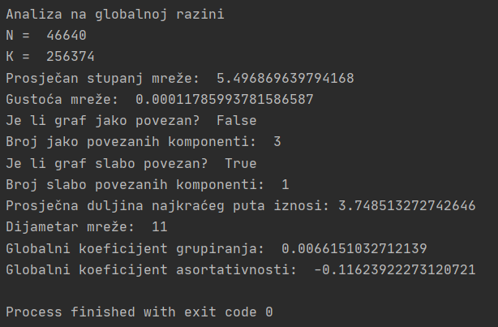

# __Covid 19 in media - Linguistic Complex Network__

This project was created as a part of the course called Knowledge Management (Upravljanje znanjem). 

<b>Faculty:</b> Department of Informatics, University of Rijeka

<b>Author:</b> Lucija Veljačić
  
<b>Mentor:</b> izv. prof. dr. sc. Ana Meštrović
  
<b>Programming language:</b> Python 3

## Description

The purpose of this project is to further analyse data collected from a Croatian web portal  [Požeška kronika](https://pozeska-kronika.hr).

The aim of the project is to analyse keywords during 4 time periods and to identify and rank keywords with respect to certain measures of centrality. The analysis is performed to find out whether the obtained keywords were related to the topic of the coronavirus pandemic that took off in the observed period.

### Technical information

__OS:__ Windows 10

__Tools and software:__
* PyCharm
* Python 3.8
* Gephi

__Packages:__

## Phase 1 - Data preparation

### Script __preparation.py__

In the first phase, data is being prepared and newspaper articles (1602 articles in total) are grouped into 4 groups, as follows:

* 1. Group: all articles created in the period __1.1.2020.-24.2.2020. - 281 articles__
* 2. Group: all articles created in the period __25.2.2020.-13.3.2020. - 118 articles__
* 3. Group: all articles created in the period __14.3.2020.-11.5.2020. - 481 articles__
* 4. Group: all articles created in the period __12.5.2020.-25.8.2020. - 722 articles__

The script __preparation.py__ reads the data from the __podaci.csv__ file and stores the text data from the Title and Text columns in a new 'Text' column.

The time period is then defined by setting the start and end dates. The values of the Text column for the defined period of time are extracted from the loaded data and stored in the file __prva.txt__ (for the __first__ data group).

* 1. Group - __prva.txt__
* 2. Group - __druga.txt__
* 3. Group - __treca.txt__
* 4. Group - __cetvrta.txt__

## Phase 2 - Construction of the linguistic network

In the second phase, the script __preparation.py__ was used again.

A __directed weighted complex network__ is created for each of the periods by observing all the adjacent pairs of words in the text read from left to right. The number of occurrences of one such pair in the text represents the weight of the connection between the two words (nodes).

The created complex networks are stored in in .txt and .edges files.

* 1. Group - __prva_mreza.txt__, __prva_mreza.edges__
* 2. Group - __druga_mreza.txt__, __druga_mreza.edges__
* 3. Group - __treca_mreza.txt__, __treca_mreza.edges__
* 4. Group - __cetvrta_mreza.txt__, __cetvrta_mreza.edges__

## Phase 3 - Analysis of the linguistic network

The script __preparation.py__ was again used, this time to extract the textual data for the entire time period. This data will be used to analyze the entire complex network. The data is stored in the file __cijeli_tekst.txt__ and the created complex network is stored in __cijela_mreza.txt__ and __cijela_mreza.edges__.

### Global network level analysis

The analysis at the global level was performed with the script __Global.py__.

Firstly, the script loads the complex network from __cijela_mreza.edges__ as a directed weighted graph.  Separately, it also loads it as an undirected graph, for the purpose of calculating the diameter.  Diameter is a maximum distance between 2 nodes in the graph - for the purpose of calculation, the graph must not be directed.

After reading the graph, the script calculates the __global measures__ of the network, such as the total number of nodes and edges, 
the average degree of the network, the density of the network, the number of connected components, the average shortest path length, the diameter, the transitivity, and the assortativity coefficient. 

The graph (network) has 46,640 __nodes__ or words, and 256,374 __edges__, which represent connections between words. In this case, the edge refers to every two words that follow one another in the text. The __degree of a node__ is the number of edges connected to the node, so the __average degree of the network__ represents the average number of connections for each node in the graph and is 5.49. __Network density__ is the ratio of the number of realized and possible connections in a graph. 

Furthermore, the graph was checked for its number of __strongly__ and __weakly connected components__, as well as the number of __connected components__. The graph is not strongly connected, meaning it has several strongly connected components, which means that not all other nodes can be reached from each node in the graph. However, there is only one weakly connected component, which means that if we ignore the orientation of the connections it is possible to get from each node to every other node in the graph. 

__The shortest path__ between 2 nodes represents the smallest number of connections that need to be passed to get from one node to another, and the average length of the shortest path indicates what is the average length of the shortest path between all nodes in the graph. __The diameter__ represents the greatest distance between the nodes of the graph, it is the largest value among the shortest paths in the network and equals 11. __The transitivity ratio__ represents the ratio of the number of closed triplets of nodes in the graph and the total number of connected triplets. __The assortativity coefficient__ shows how many network nodes connect to similar nodes, for example, hubs with hubs and the like.

__The degree histogram__ has the expected shape for a __complex network with real entities__, meaning that most nodes have a small degree, while a very small number of nodes have a large degree, as seen in the following image. There are a total of 46,640 nodes, and high degree nodes (connected to many other nodes - words) refer mostly to stopwords, which occur frequently.

 

### Local network level analysis

## Phase 4 - Analysing results
